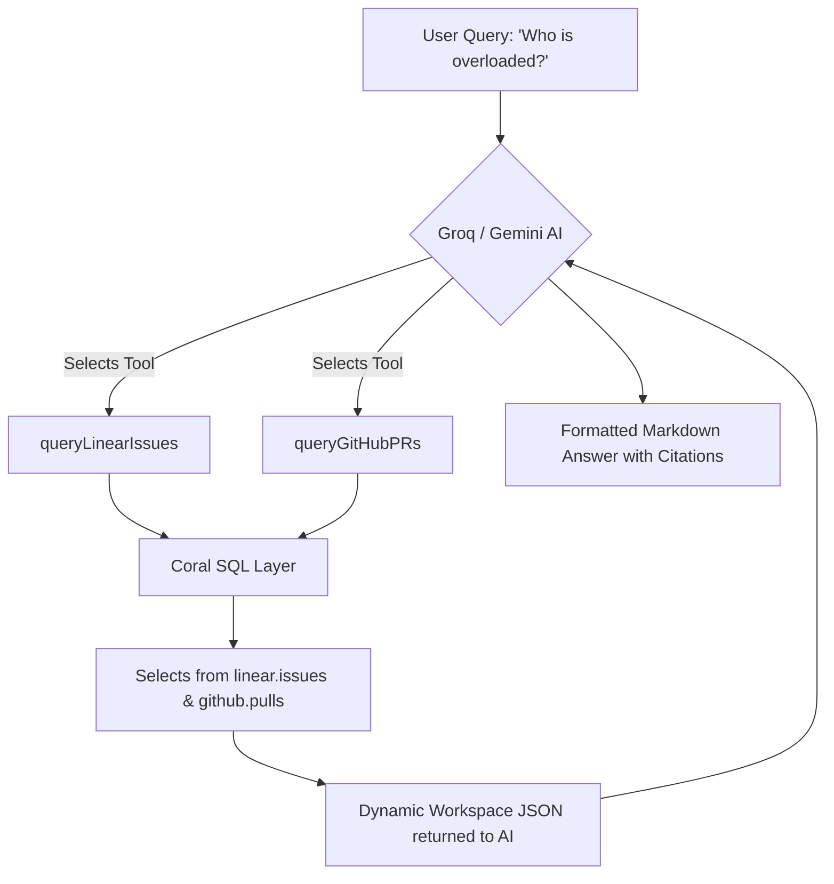

# ⚙️ Sprint Intel (Backend) — Context-Aware API Orchestrator

[](https://sprint-intell-backend.onrender.com)
[](https://expressjs.com/)
[](https://withcoral.com)

This is the backend API orchestrator for **Sprint Intel**, a context-aware developer operations partner. The server handles telemetry connections, executes live SQL queries against developer workspaces using the **Coral SQL Retrieval Layer**, and drives reasoning agents using **Groq** and **Gemini** with native tool-calling.

---

## 🛠️ Technology Stack & APIs

*   **Runtime**: Node.js & Express.
*   **Workspace Data Layer**: Coral SQL CLI integration.
*   **AI Engine**: Groq (Llama-3-8b) & Google Gemini 1.5.
*   **Proxy Gateway**: OpenRouter integrations supporting custom operational models (`openai/gpt-oss-120b`).

---

## ⚡ Engineering Highlight: Workspace Tool-Calling Architecture

Sprint Intel does not reason over stale data. We configured a dual-agent **Native Tool-Calling Pipeline** using Groq and Gemini. When a user asks an operational question (e.g. *“Who is overloaded?”*), the LLM dynamically decides which tools to execute:




---

## 📂 Configuration (`.env`)

Create a `.env` file in the root directory:
```ini
PORT=5001
GEMINI_API_KEY=your_gemini_api_key
GROQ_API_KEY=your_groq_or_openrouter_api_key
GROQ_MODEL=openai/gpt-oss-120b

```

---

## 🐳 Containerized Launch (Docker & Compose)

We provide fully configured Docker environments that automatically install the **Coral CLI** and Node runtime dependencies safely inside an isolated environment.

### Using Docker Compose
1. Ensure your `.env` variables are configured.
2. Build and launch the containerized application stack:
   ```bash
   docker-compose up --build
   ```
The backend service will boot and automatically register GitHub, Linear, and Slack sources if the respective environment keys (`GITHUB_TOKEN`, `LINEAR_API_KEY`, `SLACK_TOKEN`) are declared in your `.env`!

---

## 🛠️ Coral CLI Local Authentication Setup

If you prefer to run the backend locally outside of Docker and query actual workspace records, you must authenticate the **Coral CLI** on your host machine:

### 1. Install Coral CLI:
Run the official installation script:
```bash
curl -fsSL https://withcoral.com/install.sh | sh
```

### 2. Register Database Sources:
Add your integrations as queryable schema databases:
```bash
# Add active repositories
coral source add --interactive github

# Sync Linear tickets
coral source add --interactive linear

# Sync Slack 
coral source add --interactive slack
```
Once added, Coral registers standard SQL schemas (`github`, `linear`, `slack`), enabling Sprint Intel to query live workspace dimensions seamlessly!

## 🎥 Sprint Intel — 3-Minute Video Demo

[](https://www.youtube.com/watch?v=iFJG41VjdAU)

